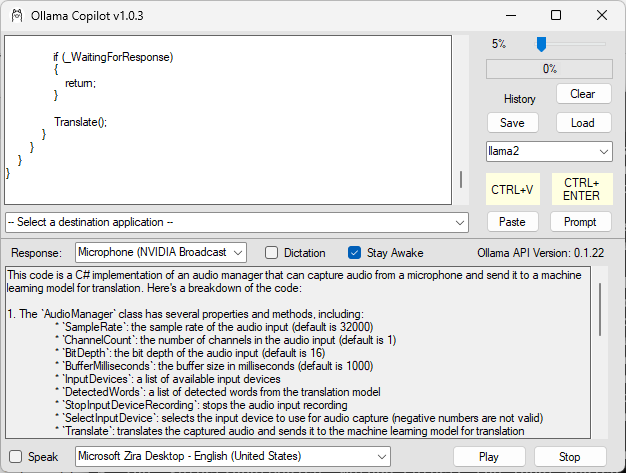
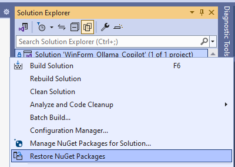
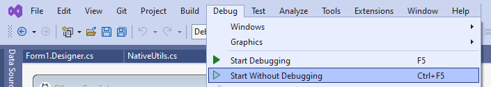
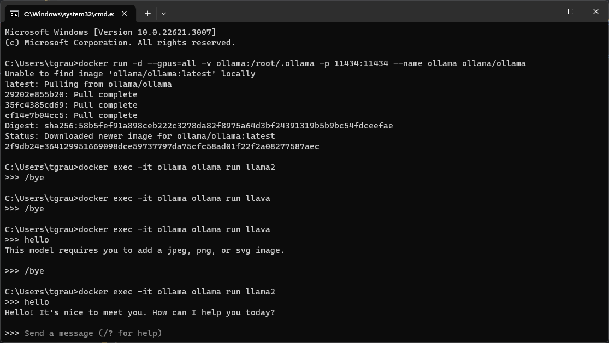

# Ollama Copilot

This project is a Windows Form application.

The application has a text prompt that uses the Ollama chat API. Application windows are listed in a drop down. Ollama responses are placed into the clipboard and pasted into the selected application specified by the dropdown.

## Screenshots



## Videos

**Overview of Ollama Copilot**

<a target="_blank" href="https://www.youtube.com/watch?v=4mKgcgBTwCo"></a>

**Ollama Copilot v1.0.0**

<a target="_blank" href="https://www.youtube.com/watch?v=Jh6jCRSlclk"></a>

**Youtube Transcripts**

<a target="_blank" href="https://www.youtube.com/watch?v=lY-6ZdsuHS8"></a>

## Dependencies

* [Ollama AI](https://ollama.ai)

* Open `WinForm_Ollama_Copilot.sln` in Visual Studio.

* The project uses Newtonsoft JSON so right-click the solution in solution explorer to select `Restore NuGet Packages`



* Build and run the application



* [Html Agility Pack](https://html-agility-pack.net/)

* [youtube-transcript-api-sharp](https://github.com/BobLd/youtube-transcript-api-sharp)

### Ollama With Docker

* Install [Docker Desktop](https://www.docker.com/products/docker-desktop/)



```shell
docker run -d --gpus=all -v ollama:/root/.ollama -p 11434:11434 --name ollama ollama/ollama
```

* Install the `llama2` model to enable the Chat API.

```shell
docker exec -it ollama ollama run llama2
```

* Install the `llava` model

```shell
docker exec -it ollama ollama run llava
```

* Install the `mixtral` model (requires 48GB of RAM)

```shell
docker exec -it ollama ollama run mixtral
```
