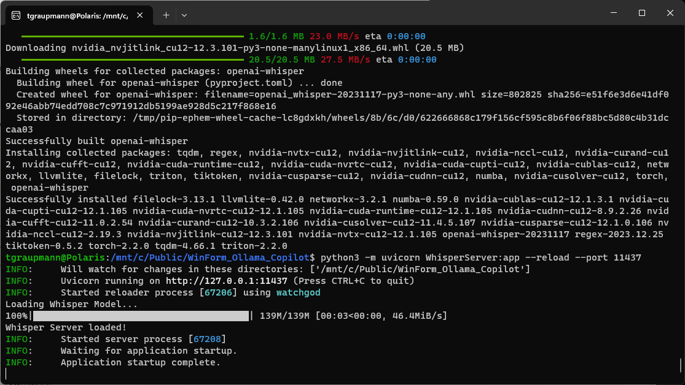
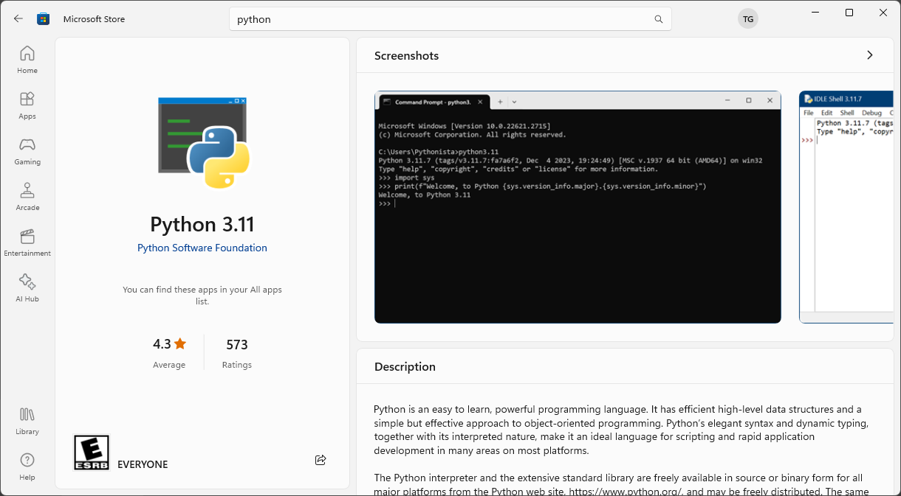

# Ollama Copilot

This project is a Windows Form application.

The application has a text prompt that uses the Ollama chat API. Application windows are listed in a drop down. Ollama responses are placed into the clipboard and pasted into the selected application specified by the dropdown.

## Screenshots


## Videos

**Overview of Ollama Copilot**

<a target="_blank" href="https://www.youtube.com/watch?v=4mKgcgBTwCo"></a>

**Ollama Copilot v1.0.0**

<a target="_blank" href="https://www.youtube.com/watch?v=Jh6jCRSlclk"></a>

**Youtube Transcripts v1.0.1**

<a target="_blank" href="https://www.youtube.com/watch?v=lY-6ZdsuHS8"></a>

**Speech to Text v1.0.2**

<a target="_blank" href="https://www.youtube.com/watch?v=BBn0__pgHIA"></a>

**Text to Speech v1.0.3**

<a target="_blank" href="https://www.youtube.com/watch?v=rVadgr7rnVk"></a>

## Dependencies

* [Ollama AI](https://ollama.ai)

* Open `WinForm_Ollama_Copilot.sln` in [Visual Studio 2022](https://visualstudio.microsoft.com/).


* The project uses Newtonsoft JSON so right-click the solution in solution explorer to select `Restore NuGet Packages`


* Build and run the application


* [Html Agility Pack](https://html-agility-pack.net/)

* [youtube-transcript-api-sharp](https://github.com/BobLd/youtube-transcript-api-sharp)

* [Whisper](https://github.com/openai/whisper.git)

* [Pyttsx3](https://pypi.org/project/pyttsx3/)

* [Teseract-OCR](https://tesseract-ocr.github.io/tessdoc/Installation.html)

### Ollama with Windows preview

* Install the [Ollama Windows preview](https://github.com/ollama/ollama)

* Install the `llama2` model to enable the Chat API

```shell
ollama run llama2
```

* Install the `llava` model

```shell
ollama run llava
```

### Ollama with Docker

* Install [Docker Desktop](https://www.docker.com/products/docker-desktop/)


```shell
docker run -d --gpus=all -v ollama:/root/.ollama -p 11434:11434 --name ollama ollama/ollama
```

* Install the `llama2` model to enable the Chat API.

```shell
docker exec -it ollama ollama run llama2
```

* Install the `llava` model

```shell
docker exec -it ollama ollama run llava
```

* Install the `mixtral` model (requires 48GB of VRAM)

```shell
docker exec -it ollama ollama run mixtral
```

## Launch Whisper Server to enable local dictation

### WSL2

* Install Ubuntu 22.04.3 LTS with WSL2

* Setup Ubuntu for hosting the local [Whisper](https://openai.com/research/whisper) server

```shell
sudo apt-get update
sudo apt install python3-pip
sudo apt install uvicorn
pip3 install FastAPI[all]
pip3 install uvloop
pip3 install numpy
sudo apt-get install curl
sudo apt-get install ffmpeg
pip3 install ffmpeg
pip3 install scipy
pip3 install git+https://github.com/openai/whisper.git
```

* Run the server

```shell
python3 -m uvicorn WhisperServer:app --reload --port 11437
```



# Useful information on Whisper model sizes.

* Source: [Whisper](https://github.com/openai/whisper)

## Available models and languages

There are five model sizes, four with English-only versions, offering speed and accuracy tradeoffs. Below are the names of the available models and their approximate memory requirements and inference speed relative to the large model; actual speed may vary depending on many factors including the available hardware.

|  Size  | Parameters | English-only model | Multilingual model | Required VRAM | Relative speed |
|:------:|:----------:|:------------------:|:------------------:|:-------------:|:--------------:|
|  tiny  |    39 M    |     `tiny.en`      |       `tiny`       |     ~1 GB     |      ~32x      |
|  base  |    74 M    |     `base.en`      |       `base`       |     ~1 GB     |      ~16x      |
| small  |   244 M    |     `small.en`     |      `small`       |     ~2 GB     |      ~6x       |
| medium |   769 M    |    `medium.en`     |      `medium`      |     ~5 GB     |      ~2x       |
| large  |   1550 M   |        N/A         |      `large`       |    ~10 GB     |       1x       |

## Test the Whisper mode conversion MP3 to text

```shell
python3 WhisperTest.py audio.mp3
```

## Launch Pyttsx3 Server to enable text to speech

### Windows

* Install [Python](https://apps.microsoft.com/detail/9NRWMJP3717K?hl=en-us&gl=US) from the Microsoft Store app on the Windows host machine which has access to the sound card.



* Open the Windows command prompt to install dependencies

```cmd
pip3 install uvicorn
pip3 install FastAPI[all]
pip3 install pyttsx3
```

* Launch the Pyttsx3 Server in the Windows command prompt

```cmd
python3 -m uvicorn Pyttsx3Server:app --reload --port 11438
```

### Speech Commands

* "Prompt clear" - Clears the prompt text area

* "Prompt submit" - Submits the prompt

* "Response play" - Speaks the response

- "Response clear" - Clears the response text area

## Launch Tesseract-OCR server for real-time OCR

### Windows

* Install `pytesseract`

```shell
pip install pytesseract
```

* Install Tesseract-OCR - [Installation](https://tesseract-ocr.github.io/tessdoc/Installation.html)

* Windows Installer - [Tesseract at UB Mannheim](https://github.com/UB-Mannheim/tesseract/wiki)

* Add Tesseract to your path: `C:\Program Files\Tesseract-OCR`

* Run the server

```shell
python3 -m uvicorn TesseractOCRServer:app --reload --port 11439 --log-level error
```
