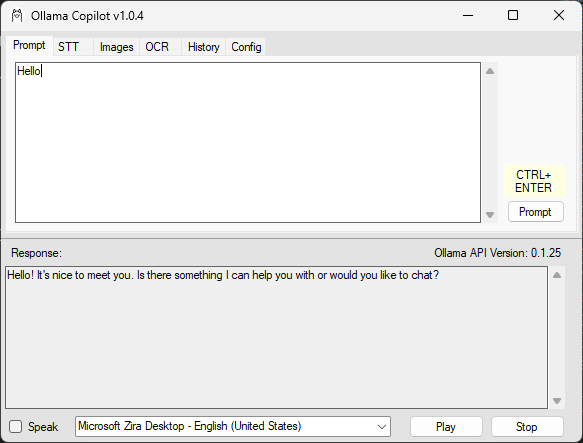

# Ollama Copilot

This application is a Windows Form application that should run on Windows and Mac.

The application has a text prompt that uses the Ollama chat API. Application windows are listed in a drop down. Ollama responses are placed into the clipboard and pasted into the selected application specified by the dropdown.

## Screenshots



## Dependencies

* [Ollama](https://ollama.ai)

### Ollama With Docker

* Install [Docker Desktop](https://www.docker.com/products/docker-desktop/)

```shell
docker run -d --gpus=all -v ollama:/root/.ollama -p 11434:11434 --name ollama ollama/ollama
```

* Install the `llama2` model to enable the Chat API.

```shell
docker exec -it ollama ollama run llama2
```
